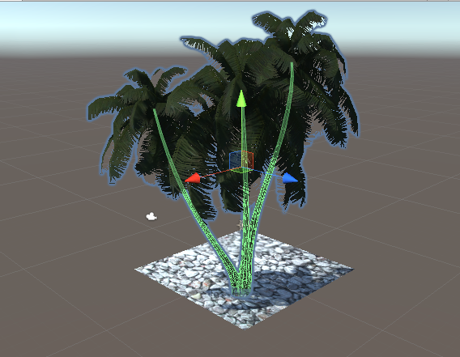
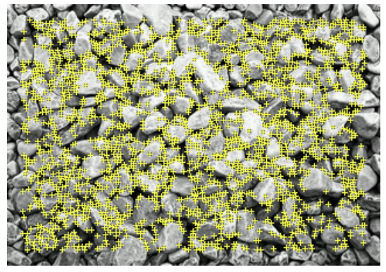
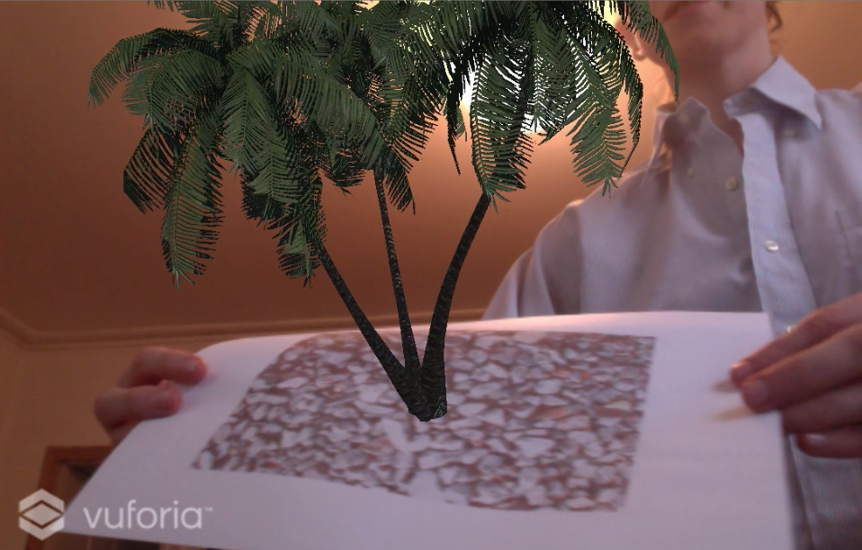
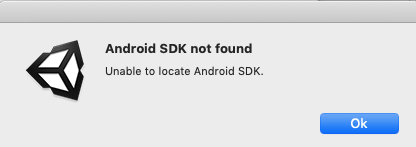
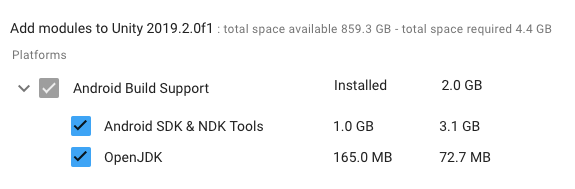

# Approach

25 mins || Done
- Environment setup: 
* How to deploy Unity app 
* Set up repo / file setup
* Spoke to Magnus - deployed app to Oculus but that is for Rift or VR
* Vuforia is a software development kit - ‘leading AR platform’. Found this [tutorial](https://www.youtube.com/watch?v=HnjbTytHH6U). Need to get image for app to appear on. Images have an augmental score - lots of targets. Then download database for Unity editor. But I already have Unity so I don’t need to do that.
Assets -> Import package -> Custom package. 
Add character to target image, set positioning to 0, 0, 0. 
How to get to mobile. File -> Build settings -> Select Androis. In PlayerSettings. 
* Deploy with ARCore, Vuforia?

25 mins || Done
* Weird to sign up to Vufuria - problem with license. Don’t need it, can do it straight form Unity.
* What do I add to .gitignore? Found this: [How to Git with Unity](https://thoughtbot.com/blog/how-to-git-with-unity). Need to wait for Unity to finish updating.
* Updating Unity - slowing down computer massively. Remember to check out if Unity are giving any talks.
* Ran `git lfs install` in repo. Need to install homebrew. Added `.gitattributes` file to manage large Unity files.

25 mins || Plan
* Find tree from Unity asset store. 
* Add tracking image to plane + add tree to scene.

Done
* Downloaded and imported Yughues palm trees
* Added tracking image to plane
* Added first tree! 



* Need to invest in a mouse for easier use of Unity

25 mins || Done
* Made palm tree child of plane
* Need to add ARCamera to the scene. Import Vudforia Unity extension - took a short while to locate where + wait for download.
* Added Vuforia AR Camera to the scene. The gide I'm using mentions a liscense key but must be for an older version. Now when I play the scene, I see my computer's webcam.

25 mins || Done
* Added Vuforia lscense key to app in Unity.
* Created database in Vuforia to add tracking image which has lots of tracking features as highlighted by yellow crosses.


* Downloaded database in Unity Editor
* Imported custom assets in Unity from database.
* This guide is quite outdated and the steps are not in order so going to try and find a different guide. Frustrating as it feels like i'm trying to go backwards - wondering if at this point it's easier to start a new project.

45 mins || Done
* Started project again as now have a clear idea what I need to do, Tutorial had left out step in initial instructions and I was finidng it difficult to go back and put that in.
* Got it sorted!

 <br>



25 mins || Done
* Tried to build project as Android app but Android SDK not found. What is Android SDK?


```
The Android SDK (software development kit) is a set of development tools used to develop applications for Android platform. The Android SDK includes the following:

Required libraries
Debugger
An emulator
Relevant documentation for the Android application program interfaces (APIs)
Sample source code
Tutorials for the Android OS
```
* Downloaded Android Studio for Mac and setup installation... 
* Researched how to run my app via SDK. 
* Verifying Adroid Studio... 
* Tried importing Unity project to Android Studio but no frameworks detected. Maybe I need to create an Android project from scratch.
* Need to add Android SDK to Unity via preferences. Huawei P20 Pro uses the Android platform 8.1 (Oreo), upgradable to 9.0 (Pie). Installing Oreo via Android Studio preferences. 
* Found this in Unity Hub! More installing...



25 mins || Done
* Tried to build and run Android app but device not found though phone is plugged in. Need to enable USB debugging somehow.
* Need to go to developer mode on mobile phone: Settings > About phone > Build Mode (tape 7 times) - `You are now a developer!`. 
* Build seems to have initially worked but then has frozen on `Buildng Gradle project`
* Finally uploaded! <br><br>
