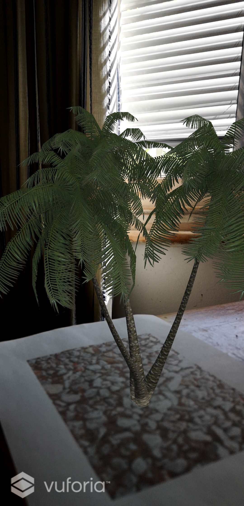

# Palm Tree
**MVP** 
 An AR app for Android to simulate a peaceful tree. For further details on how I built this, please see the [APPROACH.md](APPROACH.md) file.

**Additional features**  
Each time the user interacts with the tree on their phone, a different creature appears.

**Technologies**  
This project was built with Unity and Android Studio. The current project settings are for a Huawei P20 Pro.

<!-- 
_AR simulation on webcam._ -->

**App deployed on Android device**

